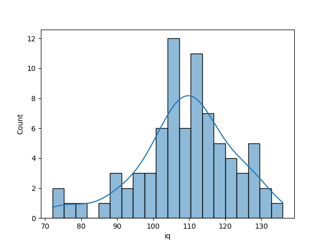
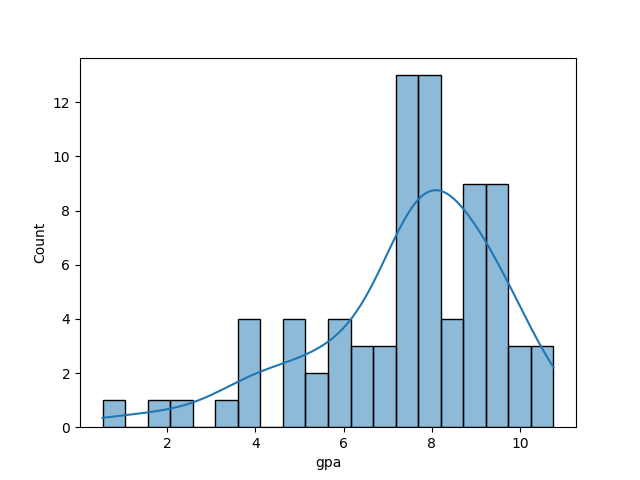
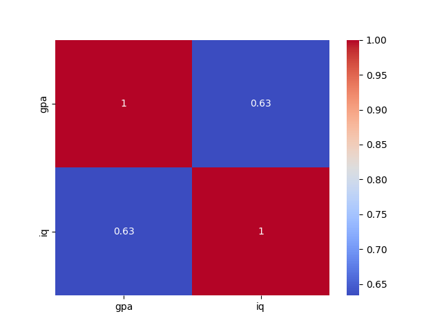
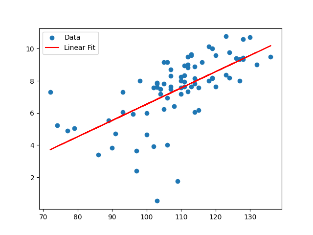

# GPA and IQ Data Analysis  

## Overview  
This project explores the relationship between GPA and IQ using statistical analysis and visualizations. The dataset is sourced from Kaggle and includes additional variables such as gender and concept scores.  

## Dataset  
- **Source:** [GPA and IQ Dataset](https://www.kaggle.com/datasets/joebeachcapital/gpa-and-iq)  
- **Description:** This dataset contains observations of GPA, IQ, gender, and concept scores for individuals. The goal is to analyze how IQ correlates with GPA and identify any significant trends.  

---

## Key Objectives  
1. **Explore the distributions** of GPA and IQ.  
2. **Analyze correlations** between GPA and IQ.  
3. **Perform a linear regression** to model the relationship between GPA and IQ.  
4. **Conduct statistical tests** to determine significant differences.  

---

## Results  

### 1. IQ Distribution  
  

### 2. GPA Distribution  
  

### 3. Correlation Heatmap  
  

### 4. Linear Regression: IQ vs. GPA  
  

---

## Statistical Insights  
- **Correlation Coefficient (r):** `TBA`  
- **P-value:** `TBA`  
- **T-test Results:** `TBA`  

---

## How to Run the Code  
1. Install the required Python packages:  
   ```bash
   pip install pandas numpy matplotlib seaborn scipy
   ```  
2. Run the Python script. 
3. Generated images will be saved in the `images` folder.  

## Conclusion  
This analysis explores the relationship between IQ and GPA using statistical methods and visualizations. Future extensions could include analyzing gender-based trends or predicting GPA using machine learning models.
